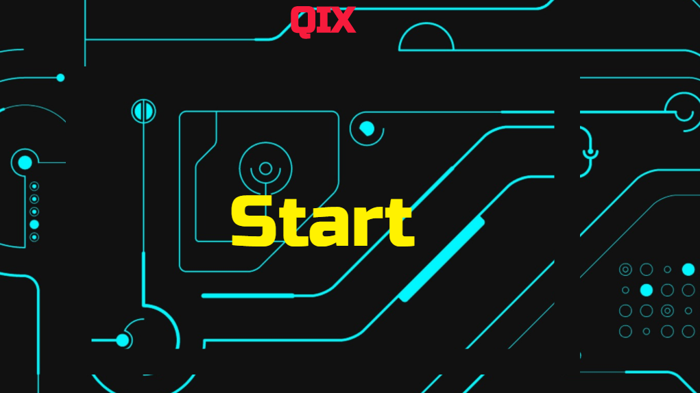

# Qix

[Play Now](https://ckane30691.github.io/Qix/)

This is a take on Qix (pronounced "kicks"), which is an arcade game released by Taito America Corporation in 1981. The objective of Qix is to fence off, or claim, a supermajority of the playfield.

## Background & Overview
The player controls a ship that can move around the edges of the board. Holding down one of the draw buttons allows the ship to move into unclaimed territory and draw lines in an attempt to create a closed shape. If completed, the captured area (defined as the side with a smaller area) becomes filled in with a solid color and points are awarded.

A life is lost if the ship touches any uncompleted line or if the marker is touched by any of the – enemies that traverse the playfield.

## Architecture & Technologies
This project will be implemented with the following technologies:
* Vanilla `JS` for overall structure and game logic
* `Keymaster JS` a micro library for defining and dispatching keyboard shortcuts in web applications
* `HTML5 Canvas` for DOM manipulation & rendering
* Webpack to bundle and serve various scripts

## Plans for Future Versions
* Give enemies AI
* Add different enemy types
* Add powerups
* Add soundFX and music
* Add different maps
* Add scoring system
* Add leaderboards
