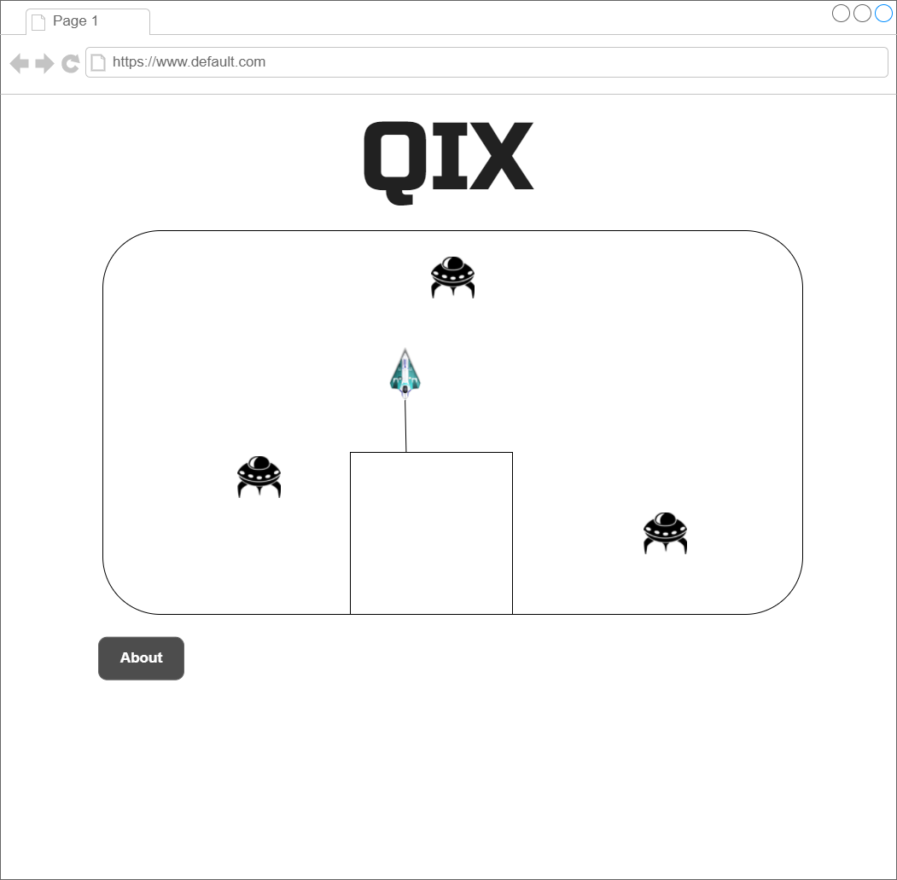

# Qix
This is a take on Qix (pronounced "kicks"), which is an arcade game released by Taito America Corporation in 1981. The objective of Qix is to fence off, or claim, a supermajority of the playfield.

## Background & Overview
The player controls a ship that can move around the edges of the board. Holding down one of the draw buttons allows the ship to move into unclaimed territory and draw lines in an attempt to create a closed shape. If completed, the captured area (defined as the side with a smaller area) becomes filled in with a solid color and points are awarded.

A life is lost if the ship touches any uncompleted line or if the marker is touched by any of the – enemies that traverse the playfield.

## Functionality & MVP
Users will be able to:
* Control the ship using the arrow keys
* Hold a draw button that allows the ship to move into unclaimed territory
* Start, pause, & restart the game

The game will also include:
* Enemies that traverse the playfield and kill the player on collision
* A difficulty setting that scales as you complete more boards
* An About modal describing the basic functionality

## Wireframes
This app will consist of a single screen with the game canvas, the game title, the explanation on the game controls and nav links to the Github repo, my LinkedIn, and the About modal.

## Architecture & Technologies
This project will be implemented with the following technologies:
* Vanilla JS for overall structure and game logic
* Keymaster JS a micro library for defining and dispatching keyboard shortcuts in web applications
* `HTML5 Canvas` for DOM manipulation & rendering
* Webpack to bundle and serve various scripts

This project will have the following scripts:

`board.js.js` - This script will handle the logic for when players capture parts of the board

`moving_object.js` - This script will hold the parent class that all moving objects in the game inherit from

`qix.js` - Sort of like my entry file if this were a react app

`enemies.js`- This script will hold all the logic for enemies

`ship.js` - This script will hold all the logic for the ship the player controls

`game.js` - This script will hold all of the game logic and rules for when a ship hits the edge of the canvas etc.

`game_view.js` - This script will handle game animation and define handlers for binding keys

`util.js` - This script will handle vectors

`ship_line.js` - This script will hold all the logic for the line drawn by the ship when the player presses the draw key

## Implementation Timeline
#### Over the weekend
* Finish proposal and study up on asteroids repo to use as guide for implementing physics in my game.
* Check out other repos of other games to see how their physics are implemented.
* Create file structure for game.  Write entry file.
* Get all necessary node modules set up and installed
#### Day 1
* Get ship and enemies rendering on the board with correct rules for Qix
#### Day 2
* Get line functionality working
### Day 3
* Get fill-in/capture functionality working
### Day 4
* Styling and add about modals

## Bonus Features
* Give enemies AI
* Add different enemy types
* Add powerups
* Add soundFX and music
* Add different maps
* Add scoring system
* Add leaderboards
